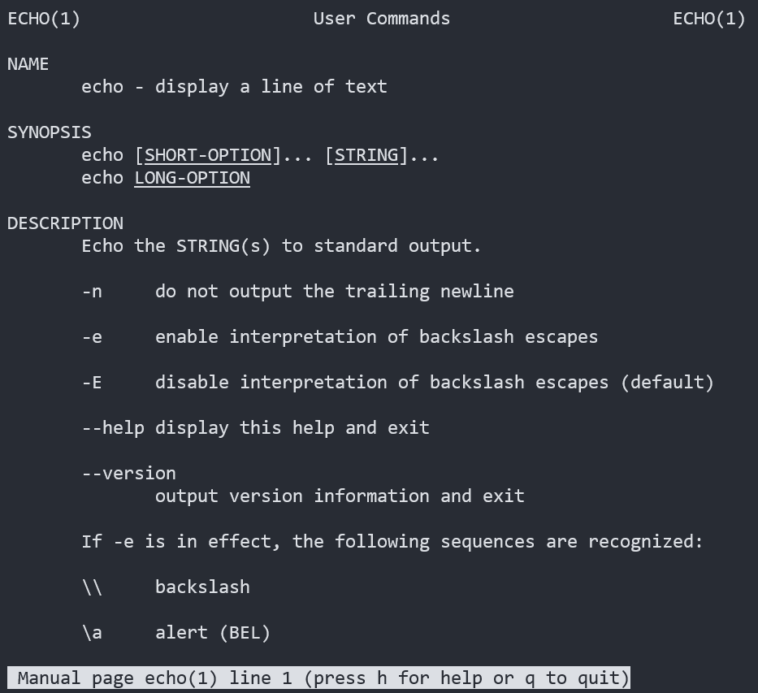

# `bash`
{: .no_toc}

## Table of contents
{: .no_toc .text-delta }

1. TOC
{:toc}

## Intro

> ["Why learn `bash` and UNIX?"](https://en.wikipedia.org/wiki/Unix_philosophy)

### Further resources
* Explains each command and options: [explainshell.com](https://explainshell.com/)
* A cheat sheet of many `bash` commands and constructs: [devhints.io/bash](https://devhints.io/bash)

At the top of any script file, it's generally good practice to specify which shell you are using:
```bash
#!/bin/bash
```

---

## Where am I?

Once you have opened a terminal, you will most likely end up somewhere like:
```
slug@13s:~$
```

The `~` (tilde) indicates you are in your home directory.

If you were in a folder called C within B within A within the home directory:

```
slug@13s:~/A/B/C$
```

| Location     |              |
| ------------ | ------------ |
| `.`          | Refers to the current directory, “here” |
| `..`         | Parent directory, “up” |
| `~`          | Home directory |
| `/dev/null`  | Like a trash can, content written into it disappears | 


**Pro tip**: you can use TAB to autocomplete the name of a file/directory once you have entered enough information for it to autocomplete. If multiple files have the same prefix, TAB can at least cover the prefix.

See the `cd` command for specific information on moving around.

---

## Files and Redirection

File redirection is exactly what it sounds like: putting or taking content from a file. Input into a file is called **`stdin`** for “standard input” (including what you type into the terminal, think of Python’s `input()` function) and output from a file is called **`stdout`** for “standard output” (including what you see appear on the terminal, think of Python’s `print()` function). There is one more path for content to go through: **`stderr`** for “standard error” which is self-explanatory.

UNIX assigns **file descriptors**, which are integers, to files and processes for referencing. All UNIX processes will include `stdin`, `stdout`, and `stderr`. They are assigned as followed:

| Stream        | File descriptor |
| ------------- | :-------------: |
| `stdin`       | 0 |
| `stdout`      | 1 |
| `stderr`      | 2 |

These operators are used to redirect the file streams into other processes.

|           |              |
| --------- | ------------ |
| `<`       | Redirect input (destination < source) |
| `>`       | Redirect output (source > destination), can manually specify to redirect `stdout` with 1> |
| `2>`      | Redirect `stderr` (stderr 2> another process or file) |
| `&>`      | Redirect both `stdout` and `stderr` (stdout/err &> another) |

For example, sending the content of text file `a.txt` into the `sort` command:
```bash
sort < a.txt
```

And then storing the sorted lines into `b.txt`:
```bash
sort < a.txt > b.txt
```

---

## Pipelining

Pipelining allows for connecting the `stdout` of one process into the `stdin` of another without having to store an intermediate file/process. An analogy for this factory’s conveyer belt where each station (process) receives a partially built item (the `stdout` of the previous process going into its `stdin`) and adding onto it before passing it along (repeat).

The syntax for pipelining is read left-to-right, where each pipe is denoted with a vertical bar `|` and where the first item is the first source of input and the last item is the last destination. If a file destination is not specified, the output is usually printed onto the terminal.
```bash
input | first | second | third | output
```
For example, the following pipeline will:
1. List out the contents of the current directory 
2. Sort out these contents alphabetically
3. List out the first three items from the sort list of files

```bash
ls | sort | head -n 3
```

An alternative syntax to the previous sorted `a.txt` to `b.txt` example would be:
```bash
cat a.txt | sort > b.txt
```
{. .note}
Notice the last part required `a >` to write into `b.txt`. 

Since this was a one step process, it may feel redundant.

Here’s a more realistic example: sorting alphabetically and counting word frequencies, and storing into `b.txt`:

```bash
cat a.txt | sort | uniq -c > b.txt
```

---

## Commands

Google exists. However, make sure you are able to explain what each command you are using is doing.

Additionally, UNIX has `man` (manual) pages for bash commands (and C functions too):

```bash
man echo
```



### Command-Line

These are your basic tools for navigating your file system, and there’s tons more.

| Command    | Purpose      | Some Options |
| ---------- | ------------ | ------------ | 
| `clear`	 | Clear your terminal screen! | |
| `ls`	     | List contents of a directory (current if no other path specified) |	`-1`: display vertically<BR>`-a`: display hidden<BR>`-s`: size of each file |
| `cd`       | Change directory	| `cd ..`: go up to parent<BR>`cd`: no options, go to `~/` (home) |
| `mkdir`    | Make a directory (folder) |
| `touch`    | Create a blank file (0 bytes) |
| `cat`      | Print out the contents of a file |
| `mv`       | Move a file |
| `cp`       | Copy a file | See also: `scp`|
| `rm`       | Remove a file/directory (**CAREFUL!**) | `-r`: recursive, for deleting folders |
| `echo`     | Print out a line | `-e`: recognize escape sequences like `\t`<BR>`-n`: omit the ending `\n` |

Try out this sequence of commands and observe the output, use ls to inspect the folders.
```bash
cd
ls -a1
mkdir step1
touch step1/a.txt
ls step1
cd step1
mkdir step2
cd step2
cp ../a.txt 
cd ..
mv step2/b.txt .
ls step2
cd
ls step1
rm -r step1
ls -1
```

### Utility commands

There are many, many more, but these should give you an idea of the types of commands that are available for use. I have purposely not included examples or options, as I want to encourage your own experimentation and research.

| Command    | Purpose      |
| ---------- | ------------ |
| `sort`     | Sort lines of a file |
| `tr`       | Translate the characters of one sequence into another (mapping abc -> def so all a’s become d’s, b’s become e’s, etc…).<BR><BR>See other patterns like `[A-Z]` and `[:upper:]`|
| `uniq`     | Find the unique lines of a file (can get frequency counts too)|
| `head`     | Print the first number of lines of a file |
| `tail`     | Print the last number of lines of a file |
| `awk`      | Run commands on structured data. A rabbit hole, do some research to get an idea of its power.<BR>Tip: `$NF` refers to the last column, `$(NF-1)` refers to the second-to-last, etc. |
| `grep`     | Search with pattern matching, can be done on files or even whole directories. |
| `pwd`      | Print the current working directory’s path |
| `wc`       | Count the bytes (characters), lines, and/or words in a file |

---

## Arithmetic

Arithmetic expressions are evaluated within` $(( ))`. 

{. .important}
Do not confuse this with $( ), which interprets the inside as a command to run!

The typical operators apply intuitively in bash:
|             |                |
| ----------- | -------------- |
| `+`         | Addition       |
| `-`         | Subtraction    |
| `*`         | Multiplication |
| `/`         | Division<BR>**Note:** this is integer division (`//` in Python) and only returns the whole number quotient, i.e 16/3 gives back 5.    |
| `%`         | Modulo (return back the remainder, 16%3 = 1) |
| `+=, -=, *=, /=, %=` | Complete the operation with the right hand constant and apply it to the left |
|  `**`       | Exponentiation |

Here’s a quick example of storing into a variable and using echo:
```bash
#!/bin/bash

a=$1
b=$2

# Can also store in a variable
sum=$((a + b))
echo "a + b = $sum"

# Making things less ambiguous with $var_name is helpful for you!
echo "a - b = $(($a - $b))"
```

---

## Logic and Testing

There are several flags that can be used to do logical/conditional testing, especially when it comes to files. Notable ones include (assume there is a path stored in a variable called $file):[^1]

|             |                            |
| ----------- | -------------------------- |
| `-a $file`  | True if the file exists    |
| `-e $file`  | Also returns True if the file exists |
| `-f $file`  | True if the file exists and is a “regular file” (i.e, not a directory file) |
| `-r`        | True if the file is readable to the current user |
| `-s`        | True if the file exists, and is not empty |
| `-w`        | True if the file is writable to the current user |


These test conditions can be placed within if-else blocks structured as followed. Some people choose to put the then on a separate line, it works either way as long as there is a concluding fi. 

{. .note}
Be mindful of the space between the [ ] and the conditions!

```bash
if [[ test conditions ]]; then
	# (some action)
elif [[ another condition ]] then
	# (some action)
...
else
	# (last action)
fi
```


For math comparisons, you can use `if (( ))` or use the following flags within an `if [[ ]]` statement:

|             |                               |
| ----------- | ----------------------------- |
| `a -eq b`   | Equality, a == b              |
| `a -ne b`   | Not equal, a != b             |
| `a -lt b`   | Strictly less than, a < b     |
| `a -le b`   | Less than or equal, a <= b    |
| `a -gt b`   | Strictly greater than, a < b  |
| `a -ge b`   | Greater than or equal, a >= b |

Example: this script takes in a single integer and outputs a corresponding message:

```bash
#!/bin/bash

num=$1

# Verify its a number
if [[ ! $num =~ '^[0-9]+$' ]]; then
    echo "Error: only input integers"
    exit 1
fi

if [ $num -lt 5 ]; then
    echo "Less than 5!"
elif [ $num -le 10 ]; then
    echo "Less than or equal to 10!"
elif [ $num -gt 10 ]; then
    echo "Greater than 10!"
elif [ $num -ge 15 ]; then
    echo "Greater than or equal to 15!"
elif [ $num -eq 50 ]; then
    echo "Equal to 50!"
else
    echo "Really big!"
fi
```

{. .highlight}
I used single `[ ]`, which is technically correct but an older standard, it’s best to use `[[ ]]` for compatibility with many different systems.


---
[^1]: Bash tests from [Stack Overflow](https://askubuntu.com/a/558990)
